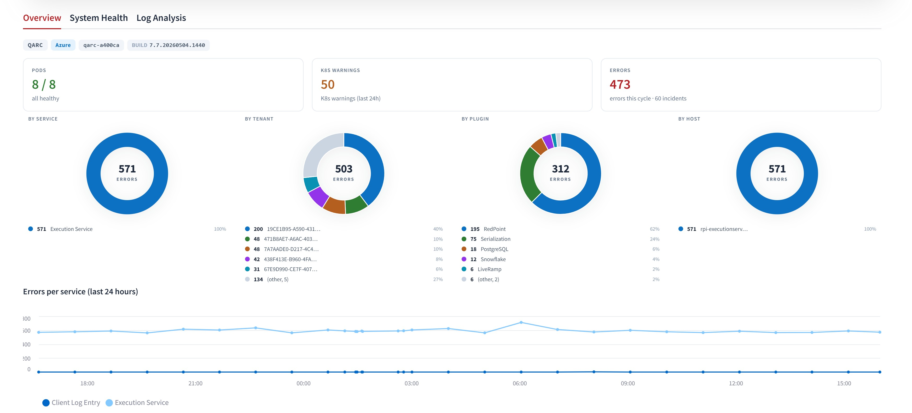

# RPI Observability

[< Back to Home](../README.md)



## Overview

**RPI Observability** is the operations component for RPI. It reads recent error rows from Pulse Logging, groups identical errors together, ranks them by operational significance, and produces a per-cycle report (what is failing, where, how often, and what matters most). It surfaces this through an operator web UI, deterministic lifecycle-driven email and Microsoft Teams notifications, and a JSON API. Alongside the cycle reports it provides a live operational view of the platform (services, workflows, tenants, nodes), per-Interaction diagnostics with a downloadable bundle, and an optional auth and capability layer that integrates with the rest of the RPI trust domain.

It is built for SRE and operations teams who want a single operational workspace spanning error activity, workflow health, tenant impact, and platform topology, plus the ability to drill into a specific Interaction for diagnostics. It does not replace your APM, metrics, or paging stack; it complements them with a scheduled (interval or daily) analysis cycle plus an operator dashboard for follow-up investigation.

The component runs in the same cluster and namespace as the rest of the RPI services. It connects to Pulse Logging using the chart's existing operational database credentials, writes its report history to a local SQLite database on a dedicated volume, and can optionally narrate its findings using the AI infrastructure RPI is already configured with.

---

<details>
<summary><strong style="font-size:1.25em;">Prerequisites</strong></summary>

**AI narration is optional and off by default.** Everything the component does -
incident grouping, significance ranking, the operator dashboard, diagnostics, and
notifications - is deterministic and fully functional with AI disabled. When AI is
enabled it adds narrative prose on top of facts that were already computed; it never
decides severity, category, ranking, or routing.

### AI infrastructure is configured once, at the platform level

Observability does **not** define its own AI provider, endpoint, model deployment, or
credentials. It inherits them from **RedpointAI** - the same configuration RPI already
uses - exactly as it inherits authentication from RPI rather than defining a second
identity provider.

This means:

- `redpointAI.enabled: true` is a **prerequisite**. Setting
  `observability.intelligence.enabled: true` without it fails at `helm template` with an
  explanatory message, before anything is deployed.
- There is nothing to configure twice. Endpoint, model deployment, API version, and the
  API key all come from the existing `redpointAI` block and the platform's
  `RPI_NLP_API_KEY` secret.
- Configure AI once and every Redpoint product consumes it.

See [RedpointAI](redpoint-ai.md) for how to configure the underlying AI infrastructure.

Observability owns its prompts, operational reasoning, recommendations, summaries, and
AI experiences. RPI owns the infrastructure underneath them.

</details>

<details>
<summary><strong style="font-size:1.25em;">What it does</strong></summary>

Each cycle:

1. Queries Pulse Logging for rows logged in the lookback window (60 minutes in interval mode, 24 hours in daily mode).
2. Filters rows below the configured severity floor.
3. Groups errors by their root pattern. Volatile content (timestamps, IDs, IPs, paths) is stripped before grouping so variants of the same underlying error land together.
4. Aggregates totals by service, tenant, plugin, and host.
5. Ranks each cluster by **operational significance** (deterministic: novelty, exception family, tenant breadth, growth, recurrence) and extracts a structured, redacted **evidence** record from the sample exception. This ranking and evidence are computed in code, never by the model.
6. Asks the configured intelligence provider for a short narrative summary and an investigative interpretation of the ranked, evidence-backed facts. The model narrates; it never decides severity, category, ranking, or routing.
7. Persists the full report to a local SQLite store.
8. Marks each error type as `new`, `recurring`, or `resolved`. An error is `new` the first time it ever appears in any report; after that it is `recurring`. An error is `resolved` if it was in the previous report but is not in the current one.
9. Runs the deterministic notification engine. Lifecycle transitions (NEW / ESCALATED / RESOLVED) over the significance-ranked incidents decide what is sent; see Notifications below.

Outside the cycle the component serves an operator web UI (Operational Core, Workflows, Tenants, Platform, Activity, Investigations) plus:

- **Live platform state** -- pod and node state from the Kubernetes API (and metrics-server when present), so operators can correlate workload health with error activity.
- **Diagnostics** -- per-Interaction lookup with SQL trace timeline, audit timeline, application logs, and a downloadable bundle (parity with the on-prem "Download Diagnostics" zip).
- **Authentication and capability-based authorization** -- opt-in trust-domain participation that gates sensitive surfaces by capability (see Authentication below).

The dashboard at `https://<your-ingress>/` is the primary entry point.

</details>

<details>
<summary><strong style="font-size:1.25em;">How it works</strong></summary>

### Schedule modes

Two scheduling modes:

| Mode | When it fires | Use case |
|:-----|:--------------|:---------|
| **Interval** (default) | Every `intervalMinutes` after pod startup | Active monitoring, short reaction time |
| **Daily** | Once a day at `dailyAtUtc` (`HH:MM` UTC) | Operations digest at a fixed time |

In daily mode the lookback window auto-defaults to 24 hours so consecutive cycles cover the full day. The schedule drives the analysis cycle; notification delivery is governed separately by the lifecycle engine and its own cadences (see Notifications).

An off-schedule cycle can be triggered via `POST /api/analyze` (and from the command palette in the web UI). Same downstream code path. When auth is enabled, this requires the `analyzer.admin` capability.

### Single-instance deployment contract

RPI Observability is **single-instance by design**. The component is one StatefulSet with `replicas: 1` and the chart rejects any attempt to override this. The single-instance shape is the architectural contract, not an accidental limitation.

What lives in the pod:

| In-pod state | Why it is single-instance |
|:-------------|:--------------------------|
| Local SQLite report store at `/data/reports.db` | One filesystem, one writer; no shared-state coordination. |
| In-process cycle scheduler | One scheduler per deployment; coordination would be required across replicas. |
| In-process authorization cache | TTL-based; per-pod is fine because there is one pod. |
| In-process token-budget bucket | Hourly cap is enforced per-pod because there is one pod. |
| Namespace-scoped K8s collectors | Bound to `Release.Namespace` via downward API. |

The chart will fail to render if `observability.replicas` is set. Multi-replica deployments are a v2 concern; do not set `replicas` in your overrides.

### Storage

Report history lives in SQLite at `/data/reports.db`. This path is canonical: it is the same in-cluster and out-of-cluster, and it is not environment-dependent. The chart mounts a persistent volume at `/data` (StatefulSet `volumeClaimTemplates` named `rpi-observability-data`, or `storage.existingClaim` if you bring your own PVC). The application reads `OBSERVABILITY__SQLITE_PATH` only as an explicit override; if you do not set the override, both the chart and the application agree on `/data/reports.db`.

SQLite needs a filesystem that honors POSIX byte-range locks, so `/data` must be backed by block storage (Azure Disk, AWS EBS, GCP PD). Network shares (Azure Files, NFS) will not work -- their lock semantics break SQLite.

When `diagnostics.fileOutput.enabled` is true and the chart-wide `storage.persistentVolumeClaims.FileOutputDirectory` PVC exists, that PVC is also mounted read-only at `/rpifileoutputdir` so diagnostic bundles can include the workflow's output files.

### AI narration

AI narration is enabled with a single switch, `intelligence.enabled`, and requires
`redpointAI.enabled: true`. Inference runs wherever RPI's AI infrastructure points -
your own Azure AI resource, in your tenant, under your network controls. Nothing about
where inference runs is an Observability decision.

| | |
|:--|:--|
| **Where inference runs** | Your Azure AI resource, as configured under `redpointAI` |
| **Privacy boundary** | Customer-managed (your Azure tenant) |
| **What is sent** | Deterministic, already-computed operational facts - never raw log payloads or stack traces |
| **Operational ownership** | Customer |

| Inherited from RedpointAI | Supplies |
|:--------------------------|:---------|
| `redpointAI.naturalLanguage.ApiBase` | The AI endpoint |
| `redpointAI.naturalLanguage.ChatGptEngine` | The model deployment |
| `redpointAI.naturalLanguage.ApiVersion` | The API version |
| `RPI_NLP_API_KEY` (in `redpoint-rpi-secrets`) | The credential |

The model is called per cycle, not per row, with a hard `intelligence.timeoutSeconds`
(default 240) so a slow inference cannot stall the cycle. Rate limits are enforced via
`budget.maxTokensPerHour` and `budget.maxRequestsPerHour`; when a budget is exceeded the
next cycle is skipped and the event is logged. **If AI is unavailable, disabled, or
times out, the cycle still completes** and the deterministic report, rankings,
dashboard, and notifications are unaffected - only the narrative prose is omitted.

### Authentication and authorization (opt-in)

Authentication is a single-provider, deployment-time choice set by `auth.mode`, resolving to exactly one of:

| `auth.mode` | Authentication |
|:------------|:---------------|
| **`public`** (default) | No authentication. The UI and API are anonymous. |
| **`native`** | RPI native auth via `rpi-interactionapi` / OpenIddict. Uses the confidential client `auth.native.clientId` (default `rpi-observability`) and the secret `Observability_NativeAuth_ClientSecret`. |
| **`entra`** | Microsoft Entra ID, via the chart-wide `MicrosoftEntraID` block (override under `auth.microsoft`). |

Hybrid configurations are rejected at chart-render time. In `native` and `entra` modes, authorization is resolved through RPI's normalized user / group / permission model in the operational database (no parallel identity store), and the tenant scope comes from `observability.clientId`.

Above the auth layer, the API and UI consume **capabilities** (`observability.view`, `diagnostics.view`, `diagnostics.viewSql`, `diagnostics.viewStackTrace`, `diagnostics.exportBundle`, `analyzer.admin`), not raw groups or roles. The canonical RPI groups map to capabilities through built-in defaults; use `auth.capabilityMap` only to grant a custom (non-canonical) RPI group access.

> **Login UI pending.** Authentication is wired end-to-end on the API (capability enforcement, native/entra token exchange, session cookies), but the current operator web UI does not yet render an in-app login screen. In `native` / `entra` mode a browser therefore cannot establish a session through the UI today. Until the login surface ships, run `auth.mode: public`, or place the dashboard behind your own authenticating proxy. API-level capability enforcement is unaffected. See the chart's `observability.auth` block for the full set of values.

### Dashboard surfaces

The operator web UI is a single operational workspace. Navigation preserves context across these areas, all gated by `observability.view`; diagnostic drill-downs add the `diagnostics.*` capabilities.

| Workspace | What it shows |
|:----------|:--------------|
| **Operational Core** | The landing surface. A live Service Map (the RPI services arranged around the operational database, with measured flow rates), per-service capacity cards, and the **Operations Brief** (significance-ranked incidents, platform posture, and the AI narrative). |
| **Workflows** | Workflow definitions to instances to activities, with lifecycle status and per-run diagnostic bundle export. |
| **Tenants** | Per-tenant health and execution-status breakdown across the deployment. |
| **Platform** | The scheduling view: which pods run on which nodes, replica spread and single-point-of-failure checks, per-node CPU / memory, and dependency health. Node panels bind a cluster-scoped ClusterRole when `nodeHealth.enabled`. |
| **Activity** | Recent failures, SQL traces, and the audit timeline. |
| **Investigations** | Incident intelligence: significance-ranked incidents, the extracted evidence, and the AI investigative interpretation. |

Clicking any entity (service, pod, node, tenant, workflow, incident) opens a **dossier** flyout without leaving the current surface. Sensitive sub-views (SQL text, stack traces, bundle export) require the matching `diagnostics.*` capability; off-schedule analysis requires `analyzer.admin`.

</details>

<details>
<summary><strong style="font-size:1.25em;">Configuration</strong></summary>

The component is opt-in. Add the following block to your overrides.

### Example A: standard deployment (AI off)

Everything except narrative prose. Incident grouping, significance ranking, the
dashboard, diagnostics, and notifications are all fully functional.

```yaml
observability:
  enabled: true
  clientId: "<rpi_Clients GUID for this deployment>"
  schedule:
    dailyAtUtc: "00:00"             # daily mode, 24 h lookback (auto)
  notifications:
    enabled: true
    defaultRecipients:
      - sre@example.com
    teams:
      enabled: true                 # webhookSecretKey defaults to Observability_Teams_Webhook
  storage:
    volumeClaimTemplates:
      enabled: true
      accessModes: ReadWriteOnce
      storage: 5Gi
      storageClassName: ""          # empty = cluster default storage class
```

### Example B: with AI narration

Add `intelligence.enabled` on top of Example A. The AI infrastructure comes from
`redpointAI` - there is nothing to configure a second time.

```yaml
redpointAI:
  enabled: true                     # prerequisite: RPI owns the AI infrastructure
  naturalLanguage:
    ApiBase: https://<resource>.openai.azure.com/
    ApiVersion: 2023-07-01-preview
    ChatGptEngine: <model-deployment-name>

observability:
  enabled: true
  clientId: "<rpi_Clients GUID for this deployment>"
  intelligence:
    enabled: true                   # inherits endpoint, deployment, API version, credential
```

The AI credential is the platform's own `RPI_NLP_API_KEY` in `redpoint-rpi-secrets` -
the same key the RPI services use. There is no Observability-specific AI secret.

> Setting `observability.intelligence.enabled: true` while `redpointAI.enabled` is
> `false` fails at render time with an explanatory message, so a misconfiguration is
> caught before deployment rather than surfacing as a silently AI-less dashboard.

### Reference

| Key | Default | Description |
|:----|:--------|:------------|
| `enabled` | `false` | Master switch. |
| `clientId` | `""` | The deployment's `rpi_Clients` GUID. Tenant scope for authorization and per-Interaction diagnostics (ADR-0009). |
| `intelligence.enabled` | `false` | AI narration. Requires `redpointAI.enabled: true`; endpoint, model deployment, API version, and credential are all inherited from it. Renders an explanatory error if enabled without it. |
| `intelligence.timeoutSeconds` | `240` | Per-inference timeout. On timeout the cycle proceeds without an AI summary. |
| `schedule.intervalMinutes` | `30` | Interval mode period. Ignored when `dailyAtUtc` is set. |
| `schedule.dailyAtUtc` | `""` | Daily mode time as `HH:MM` UTC. Empty = interval mode. |
| `schedule.lookbackMinutes` | auto | Defaults to 60 in interval mode, 1440 in daily mode. |
| `schedule.onDemandEnabled` | `true` | Exposes `POST /api/analyze`. |
| `budget.maxTokensPerHour` | `200000` | Hard cap; exceeding skips the next cycle. |
| `budget.maxRequestsPerHour` | `60` | Hard cap; exceeding skips the next cycle. |
| `nodeHealth.enabled` | `true` | Powers the Platform node panels; binds a cluster-scoped ClusterRole. Set `false` if cluster-scoped RBAC is not allowed. |
| `telemetry.mode` | `scrape` | `scrape` (native `/metrics`) or `otel` (auto-instrument participating services through a shared OTel Collector, adding per-service database-edge metrics). |
| `telemetry.muslServices` | `[rpi-integrationapi, rpi-callbackapi, rpi-deploymentapi]` | Services on musl images that need the `linux-musl-x64` OTel profiler. |
| `diagnostics.fileOutput.enabled` | `false` | Mounts the chart-wide FileOutputDirectory PVC read-only at `/rpifileoutputdir` so diagnostic bundles can include workflow output files. |
| `auth.mode` | `public` | `public`, `native`, or `entra`. Hybrid is rejected at render. |
| `auth.native.clientId` | `rpi-observability` | OpenIddict confidential client ID (`mode=native`); paired secret `Observability_NativeAuth_ClientSecret`. |
| `auth.microsoft.{tenantId,clientApplicationId,apiApplicationId}` | `""` (chart-wide) | Entra overrides (`mode=entra`); default to the chart-wide `MicrosoftEntraID` block. |
| `auth.cookieSecure` | `true` | Set `false` only for local dev without TLS. |
| `auth.sessionLifetimeSeconds` | `28800` | 8 hours. |
| `auth.ingressHost` | auto | Auto-derived from `ingress.hosts.observability` + `ingress.domain` when empty. |
| `notifications.enabled` | `false` | Master gate for the notification engine. |
| `notifications.defaultRecipients` | `[]` | Fallback recipients when a per-type list is empty. |
| `notifications.email.enabled` | `false` | Email channel (reuses the chart-wide `SMTPSettings`). |
| `notifications.teams.enabled` | `false` | Teams channel. |
| `notifications.teams.webhookSecretKey` | `Observability_Teams_Webhook` | Secret key holding the Teams webhook URL. |
| `notifications.dailyBrief.{enabled,atUtc,recipients}` | `true`, `"13:00"`, `[]` | Daily Operations Brief. |
| `notifications.weeklySummary.{enabled,dayOfWeek,atUtc,recipients}` | `false`, `0`, `"13:00"`, `[]` | Weekly Executive Summary. |
| `notifications.newIncident.{enabled,significanceThreshold,cooldownMinutes,recipients}` | `true`, `60`, `0`, `[]` | New Critical Incident alert. |
| `notifications.escalation.{enabled,minBand,scoreDelta,tenantDelta,sustainCycles,cooldownMinutes,recipients}` | `true`, `medium`, `15`, `2`, `2`, `240`, `[]` | Incident Escalation alert. |
| `notifications.resolution.{enabled,absentCycles,recipients}` | `true`, `12`, `[]` | Incident Resolution notice. |
| `storage.existingClaim` | `""` | Mount an existing PVC instead of provisioning a new one. |
| `storage.volumeClaimTemplates.enabled` | `true` | Provision via StatefulSet `volumeClaimTemplates`. |
| `storage.volumeClaimTemplates.storage` | `5Gi` | Volume size. |
| `storage.volumeClaimTemplates.storageClassName` | `""` | Empty = cluster default. |

The full set of `auth.*` keys (capability map, native + federated provider blocks, signing-key secret, etc.) is documented in the chart's `observability.auth` comments.

</details>

<details>
<summary><strong style="font-size:1.25em;">Notifications</strong></summary>

Notifications are **deterministic and lifecycle-driven**. Delivery is decided in code from each incident's lifecycle transitions over the significance-ranked clusters; the AI never gates delivery (it only narrates the Daily Brief body). The engine is off by default; set `notifications.enabled: true` to turn it on. Each notification type can be enabled or disabled independently and accepts its documented defaults unless overridden.

### Incident lifecycle

Each distinct incident (by fingerprint) moves through a code-defined lifecycle that drives the alert types:

| State | Meaning |
|:------|:--------|
| **NEW** | First appearance, or reappearance after a prior resolution. |
| **ACTIVE** | Seen again; tracked against a stable baseline. |
| **ESCALATED** | Materially worse for `escalation.sustainCycles` consecutive cycles (significance jump, band upgrade, tenant-breadth jump, or growth turning to spiking). |
| **RESOLVED** | Absent for `resolution.absentCycles` consecutive cycles. |

### Notification types

| Type | Fires when | Cadence / key settings |
|:-----|:-----------|:-----------------------|
| **Daily Operations Brief** | Once per UTC day | `dailyBrief.atUtc` (default `13:00`). Platform posture, error activity, tenant impact, primary concerns. |
| **Weekly Executive Summary** | Once per week (off by default) | `weeklySummary.dayOfWeek` (Mon=0..Sun=6), `weeklySummary.atUtc`. Recurring incidents, categories, resolved-this-week. |
| **New Critical Incident** | A NEW-lifecycle incident reaches the threshold | `newIncident.significanceThreshold` (default `60`), `newIncident.cooldownMinutes`. |
| **Incident Escalation** | An active incident escalates | `escalation.minBand`, `escalation.scoreDelta`, `escalation.tenantDelta`, `escalation.sustainCycles`, `escalation.cooldownMinutes` (default 240). |
| **Incident Resolution** | An incident clears | `resolution.absentCycles` (default `12`, about 6h at a 30-min cadence). |

### Channels

Email and Teams are independent channels under `notifications`. Recipients come from the per-type `recipients` list, falling back to `notifications.defaultRecipients`.

- **Email** (`notifications.email.enabled`) reuses the chart-wide `SMTPSettings` block (the same SMTP server, sender, and credentials the .NET RPI services use). No component-specific SMTP configuration is required.
- **Teams** (`notifications.teams.enabled`) posts to a Workflow incoming webhook whose URL is stored in `redpoint-rpi-secrets` under `notifications.teams.webhookSecretKey` (default `Observability_Teams_Webhook`). The pod fails fast at startup if the channel is enabled and the key is empty.

To create the Teams webhook URL:

1. In the target Teams channel, click `...` -> `Workflows`.
2. Pick the template `Post to a channel when a webhook request is received`.
3. Copy the URL the workflow generates.
4. Store it in `redpoint-rpi-secrets` under `Observability_Teams_Webhook` (or your `webhookSecretKey`).

</details>

<details>
<summary><strong style="font-size:1.25em;">Access and operations</strong></summary>

### Ingress

Add a host entry under your existing `ingress.hosts` block:

```yaml
ingress:
  domain: example.com
  hosts:
    observability: rpi-observability        # final URL: https://rpi-observability.example.com
```

The chart wires this into `OBSERVABILITY__EMAIL__INGRESS_URL` so the email and Teams CTA buttons link back to a working dashboard URL. When `auth.mode` is `native` or `entra`, the same host is used to construct the OIDC redirect URI advertised to the IDP (override with `auth.ingressHost` if you front the dashboard with a different external hostname).

### Internal API

The pod runs a single FastAPI process on port `8080` that serves both the operator web UI (a static Next.js build, served by FastAPI; no Node runtime in the pod) and the JSON API. The chart's ingress routes to it, and kubelet hits it for probes. When auth is enabled, `/auth/*` is served by the same process.

For ad-hoc inspection of the FastAPI surface, use a port-forward:

```bash
kubectl port-forward -n <namespace> pod/rpi-observability-0 8080:8080
curl http://localhost:8080/api/budget
```

Available endpoints (capability gating applies when `auth.mode` is `native` or `entra`):

| Endpoint | Purpose | Capability |
|:---------|:--------|:-----------|
| `GET /health/live` | Liveness probe. | (none) |
| `GET /health/ready` | Readiness probe. | (none) |
| `GET /api/reports` | List recent reports. | `observability.view` |
| `GET /api/reports/{id}` | Single report payload. | `observability.view` |
| `GET /api/reports/{id}/export.txt` | Plain-text dump of every row in every cluster. | `diagnostics.exportBundle` |
| `GET /api/trend` | Per-cycle time series for the last 24 hours. | `observability.view` |
| `GET /api/budget` | Current token / request budget status. | `observability.view` |
| `GET /api/spend` | Lifetime spend summary. | `observability.view` |
| `GET /api/settings` | Read-only summary of the active configuration. | `observability.view` |
| `POST /api/analyze` | Fire an off-schedule cycle. Disable via `schedule.onDemandEnabled: false`. | `analyzer.admin` |
| `GET /api/pods/health` | Pod state for the System Health tab. | `observability.view` |
| `GET /api/nodes/health` | Node state for the System Health tab. | `observability.view` |
| `GET /api/infra/pods` | Pod-level infra rollup. | `observability.view` |
| `GET /api/infra/events` | Recent K8s events. | `observability.view` |
| `GET /api/telemetry/snapshot` | Combined live telemetry snapshot. | `observability.view` |
| `GET /api/diagnostics/recent` | Recent Interactions for the Diagnostics tab. | `diagnostics.view` |
| `GET /api/diagnostics/lookup/{id}` | Per-Interaction detail. | `diagnostics.view` |
| `GET /api/diagnostics/{id}/bundle` | Downloadable diagnostic bundle. | `diagnostics.exportBundle` |
| `GET /auth/whoami` | Current session identity + capabilities. | (auth) |
| `POST /auth/native/exchange` | Native-posture credential exchange (browser form POST). | (none) |
| `GET /auth/sso/start` | Federated-posture OAuth start (302 to IDP). | (none) |
| `GET /auth/callback` | Federated-posture OAuth callback. | (none) |
| `GET`/`POST /auth/logout` | Clear session, 303 to `/`. | (auth) |
| `GET /auth/health` | Auth backend health (issuer, JWKS, authorization provider). | (none) |

### Logs and probes

The pod logs cycle results, scheduling decisions, and notification outcomes. Sample lines:

```
INFO  app.scheduler scheduler running in daily mode at 00:00 UTC
INFO  app.scheduler next cycle in 32400 s (daily at 00:00 UTC)
INFO  app.analyze.pipeline cycle complete: report_id=42 errors=511 clusters=8
INFO  app.notify daily brief sent: recipients=1
INFO  app.notify new-incident alert sent: significance=72 tenants=5
INFO  app.notify no lifecycle transitions this cycle; nothing to send
INFO  rpi-observability.audit auth.login.success identity_email=alice@example.com idp=native
INFO  rpi-observability.audit authz.denied capability_required=diagnostics.viewSql route=/api/diagnostics/lookup/...
```

</details>

---

## Day-2 operations

For operators running RPI Observability in production, see the **[RPI Observability Operations Guide](observability-ops.md)**. It covers what every dashboard label means, how schedule and lookback windows work (including how long it takes a fix to show as `Resolved`), notification trigger gates, the token budget, and troubleshooting the most common failure modes.

---
<sub>Redpoint Interaction v7.7 | [Helm Assistant](https://rpi-helm-assistant.redpointcdp.com) | [Support](mailto:support@redpointglobal.com) | [redpointglobal.com](https://www.redpointglobal.com)</sub>
